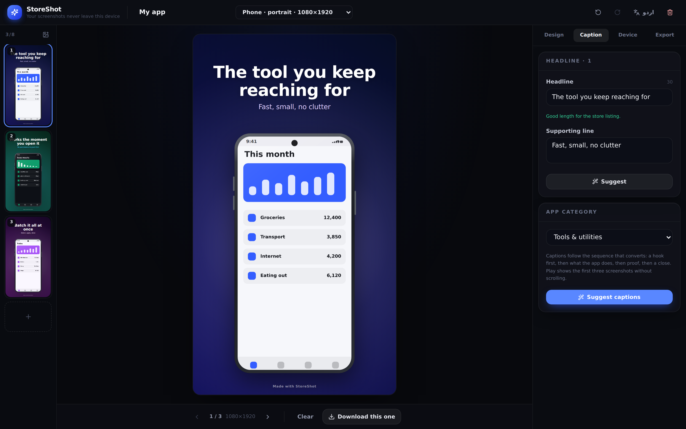

# StoreShot

Turn plain app screenshots into Google Play store listing graphics — exact
dimensions, device frames, captions and a compliance check — entirely in the
browser. Nothing is uploaded.



## Why it exists

Independent developers ship good apps with bad store listings. The screenshots
are raw captures from a personal phone: wrong size, someone's 47% battery in the
status bar, no caption saying what the app does. Play then rejects the upload for
an alpha channel nobody knew was there.

StoreShot fixes the whole chain:

- **Exact dimensions.** Every export is the size Play asks for, not a resize.
- **24-bit PNG, no alpha.** A canvas can only produce RGBA, so the PNG encoder
  is written from scratch (`src/core/png.ts`). This is the single most common
  cause of a rejected screenshot upload.
- **Status bar removed.** The detector finds the band your phone captured and
  trims it, then the frame draws a neutral one.
- **Captions that say something.** Suggestions follow the sequence that
  converts — hook, capability, proof, close — per app category, offline.
- **Colour from your app.** The palette is extracted from the screenshot, with
  saturation weighted so your brand colour wins over the grey background it sits
  on.
- **Nothing leaves the device.** No account, no upload, no server. That is why
  it can be hosted as a static site and cost nothing to run.

## Running it

```bash
npm install
npm run dev        # http://localhost:5173
```

```bash
npm run build      # static output in dist/
npm run test       # unit tests (vitest)
npm run test:e2e   # browser tests (playwright, runs against the build)
npm run lint       # typecheck
```

The build is a static bundle. Any static host will serve it; there is no backend
to deploy.

## How it is put together

```
src/core/         Rendering and rules. No React, and no DOM where avoidable.
  types.ts        The data model.
  playstore.ts    Play's requirements, and the validator that checks against them.
  render.ts       The one function that draws a slide. Preview and export both call it.
  templates.ts    The eight layouts, as pure geometry.
  frames.ts       Device frames, drawn from primitives.
  palette.ts      Colour extraction from a screenshot.
  statusbar.ts    Status bar detection.
  png.ts          24-bit PNG encoder.
  copy.ts         Caption suggestions.
  export.ts       Full-resolution render, encode, ZIP.
src/components/   The editor UI.
src/store/        State, undo history, and local persistence.
```

Two decisions are worth knowing about:

**The preview and the export run the same code.** `renderSlide` draws in logical
export pixels; the preview simply applies a scale transform first. What you
approve on screen is what lands in the file. A rendering property test in
`tests/e2e` measures the text extent at two canvas sizes and asserts they match.

**Device frames are drawn, not bundled.** The silhouettes of real handsets are
protected trade dress, and shipping a recognisable iPhone or Galaxy outline is
how a tool like this gets taken down. These frames are deliberately generic, and
they scale to any export size without resampling.

## Play specifications

`docs/PLAY_SPECS.md` records where each dimension came from and whether it has
been confirmed against a live Play Console page. **They have not been.** Confirm
them before any public release.

## Licensing

Fonts are loaded from Google Fonts, which permits embedding in exported images.
Nothing else in an export carries a third-party licence.
